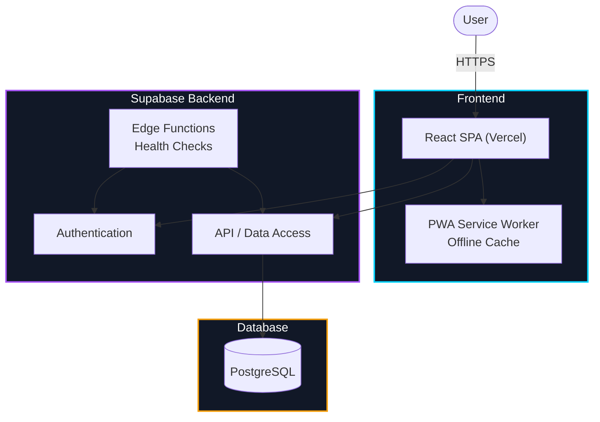
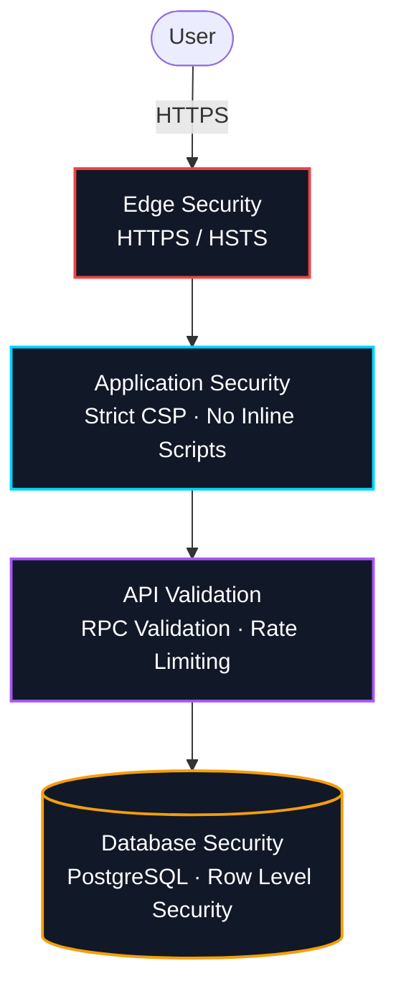
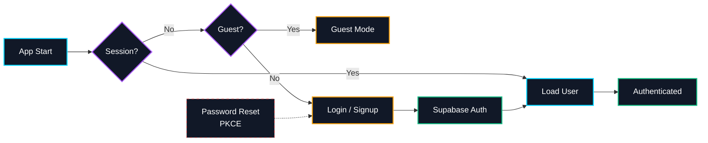
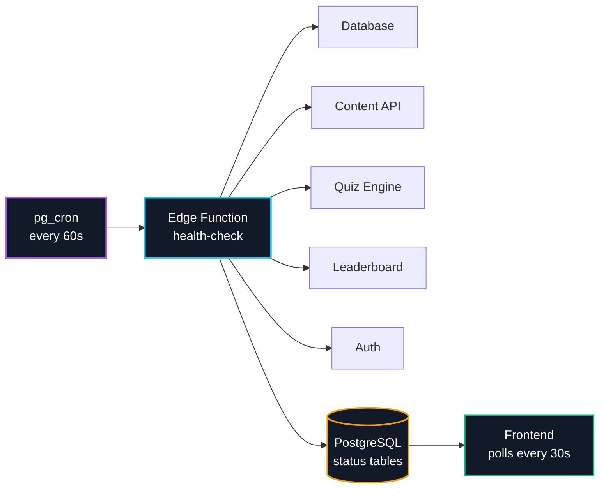
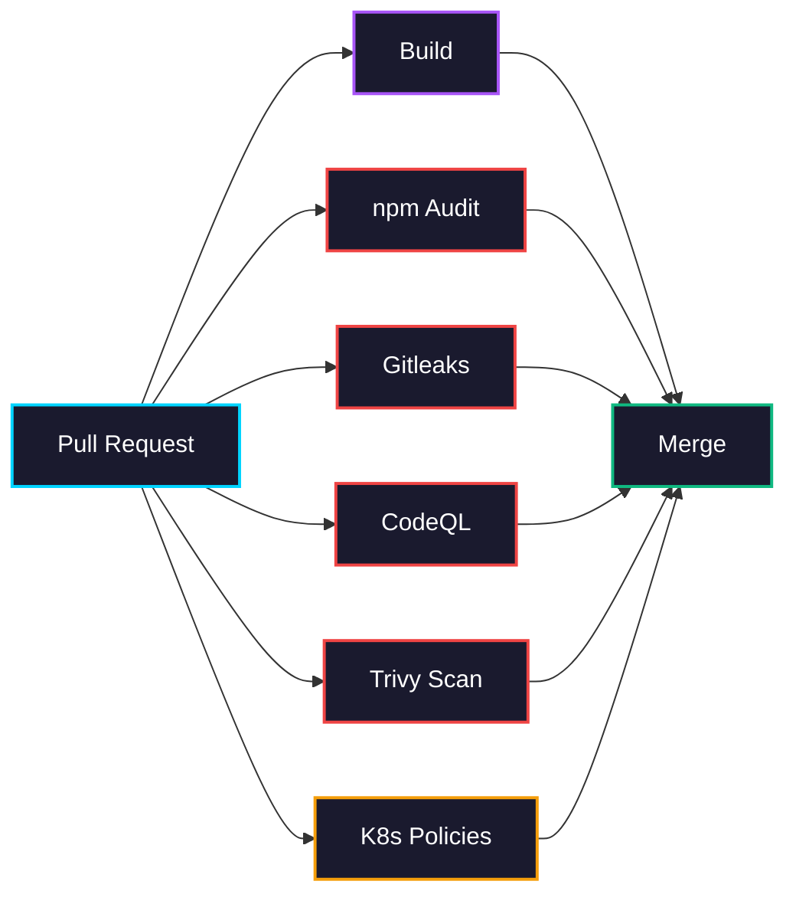
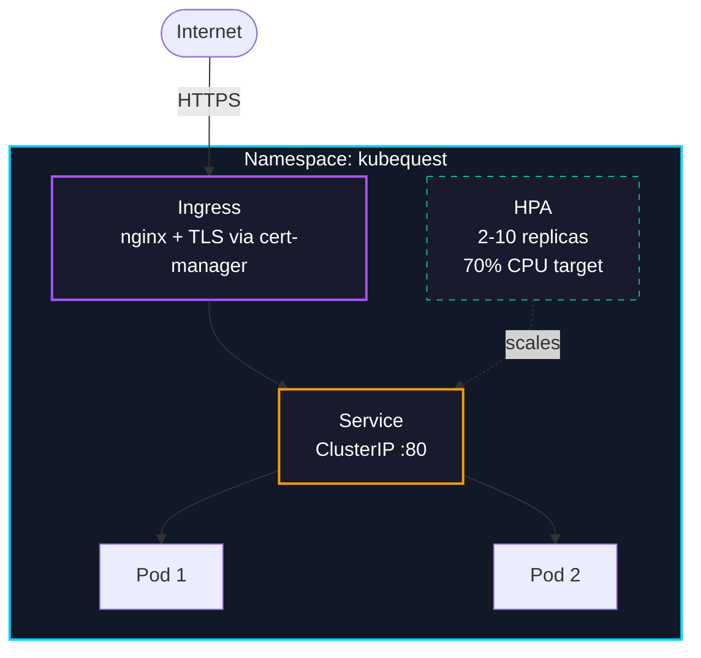

# ☸️ KubeQuest

**Interactive Kubernetes learning game for DevOps engineers.**

Practice real-world Kubernetes scenarios, sharpen your troubleshooting skills, and prepare for CKA-level interviews - through interactive quizzes, incident simulations, and daily challenges.

[](https://www.kubequest.online/)
[](LICENSE)
[](https://github.com/or-carmeli/KubeQuest/actions/workflows/ci.yml)
[](https://github.com/or-carmeli/KubeQuest/actions/workflows/security.yml)
[](https://react.dev)
[](https://vitejs.dev)
[](https://supabase.com)
[](https://github.com/or-carmeli/KubeQuest/pkgs/container/kubequest)
[](https://status.kubequest.online)

---

[kubequest.online](https://www.kubequest.online/) - no registration required, works instantly in guest mode.

<div align="center">
  
</div>

---

## Table of Contents

- [Features](#features)
- [Tech Stack](#tech-stack)
- [Architecture](#architecture)
- [Security Model](#security-model)
- [Authentication Flow](#authentication-flow)
- [Observability](#observability)
- [CI/CD & Supply Chain Security](#cicd--supply-chain-security)
- [Kubernetes Deployment](#kubernetes-deployment)
- [Local Development](#local-development)
- [Docker](#docker)
- [Testing](#testing)
- [Project Structure](#project-structure)
- [Contributing](#contributing)

---

## Features

- **🚨 Incident Mode** - multi-step Kubernetes failure scenarios with step-by-step diagnosis and scoring
- **🧠 Topic Quizzes** - 5 topics x 3 difficulty levels, progressively unlocked
- **🔥 Daily Challenge** - 5 fresh questions every day
- **🎲 Mixed Quiz** - random questions across all topics
- **🎯 Interview Mode** - mandatory timer, hints disabled, exam pressure
- **📖 Kubernetes Guide** - built-in cheatsheet for quick lookup while practicing
- **🗺️ Roadmap View** - visual learning path through all topics and levels
- **📉 Weak Area Card** - surfaces your lowest-accuracy topic automatically
- **↩️ Quiz Resume** - continue where you left off after refresh or navigation
- **🏆 Leaderboard** - global top scores
- **🏅 Achievements** - milestone-based reward system
- **🌐 Hebrew / English** - full bilingual support with RTL layout
- **👤 Guest Mode** - no account needed; sign up to sync progress across devices
- **📊 Real-Time Monitoring** - live status page with health checks, uptime history, and auto-detected incidents

---

## Tech Stack

| Layer | Technology |
|-------|-----------|
| Frontend | [React 19](https://react.dev) + [Vite 5](https://vitejs.dev) |
| Backend | [Supabase](https://supabase.com) (PostgreSQL + Auth + Edge Functions) |
| Hosting | [Vercel](https://vercel.com) (Edge Network + CDN) |
| Containerization | Docker (multi-stage build, nginx:alpine, ~25MB) |
| Orchestration | Kubernetes (Deployment, HPA, Ingress, cert-manager) |
| CI/CD | GitHub Actions (build, scan, sign, attest) |
| Supply Chain | [Cosign](https://docs.sigstore.dev/cosign/overview/) + [Trivy](https://trivy.dev/) + SBOM + Provenance |
| Security | CSP, HSTS, CORS, RLS, CodeQL, npm audit |
| Monitoring | Supabase Edge Functions + pg_cron (60s interval) |
| Testing | [Vitest](https://vitest.dev) |
| Dependency Management | [Dependabot](https://docs.github.com/en/code-security/dependabot) (weekly - npm, Docker, Actions) |

---

## Architecture

### Runtime



### Stack Layers

**Frontend** - React single-page application built with Vite, deployed on Vercel. Includes a manual service worker for offline caching and a PWA manifest for installability. All routing is handled client-side.

**Platform** - Vercel Edge Network serves static assets and runs Edge Middleware for request validation, host header verification, and automated scanner blocking. Security headers (CSP, HSTS, COOP, CORP) are enforced via `vercel.json`.

**Backend** - Supabase provides authentication, real-time subscriptions, and a PostgreSQL database. All sensitive operations (answer validation, score updates) run through `SECURITY DEFINER` RPC functions that enforce server-side logic. A Supabase Edge Function runs periodic health checks across all services.

---

## Security Model



| Layer | Controls |
|-------|----------|
| Edge | HTTPS enforced, HSTS (1 year, preload), strict CORS |
| Application | Content Security Policy (no inline scripts), X-Frame-Options DENY, COOP/CORP same-origin |
| API | `SECURITY DEFINER` RPC endpoints, rate limiting on answer verification |
| Database | Row Level Security on all tables, server-side validation |
| Container | Cosign-signed images, SBOM attestations, Trivy scanning, Kyverno policy enforcement |
| Code | CodeQL static analysis, npm audit, Gitleaks secret scanning, Dependabot weekly updates |

---

## Authentication Flow

KubeQuest uses Supabase Authentication for user management. Authenticated users have their progress synced to the cloud, while guest mode allows full access without registration - progress is stored locally. Password reset uses the PKCE flow for secure email-based recovery. Sessions persist across page reloads via Supabase's session storage.



---

## Observability

A Supabase Edge Function executes health checks every 60 seconds via `pg_cron`, monitoring 5 services:

| Service | Check |
|---------|-------|
| Database | `SELECT` on `user_stats` |
| Content API | `get_mixed_questions` RPC |
| Quiz Engine | `check_quiz_answer` RPC |
| Leaderboard | `get_leaderboard` RPC |
| Authentication | GoTrue `/auth/v1/health` |



- **Status classification** - operational (<2s), degraded (>2s), down (error)
- **Auto-incident detection** - 3 consecutive failures trigger automatic incident creation
- **Data retention** - append-only `system_status_history` table for uptime tracking
- **Frontend** - live status page with real-time polling

Full documentation: [docs/monitoring.md](docs/monitoring.md) | Live status: [status.kubequest.online](https://status.kubequest.online)

---

## CI/CD & Supply Chain Security

### Workflows

| Workflow | Trigger | Purpose |
|----------|---------|---------|
| [ci.yml](.github/workflows/ci.yml) | Every PR / push to `main`, `dev` | Build + npm audit + Gitleaks + CodeQL + Trivy + K8s policy (PR gate) |
| [docker.yml](.github/workflows/docker.yml) | Push to `main` / version tags | Build, scan, push to GHCR, SBOM + provenance, Cosign sign |
| [security.yml](.github/workflows/security.yml) | Weekly (Monday) + on-demand | npm audit + Trivy + CodeQL for newly disclosed CVEs |

### PR Gate (shift-left)

All six CI jobs must pass before a PR can merge:



### Publish Pipeline (post-merge)

```mermaid
flowchart LR
    PUSH["Push to main"] --> SCAN["Build &<br/>Trivy Scan"] --> GHCR["Push to<br/>GHCR"] --> ATTEST["SBOM +<br/>Provenance"] --> SIGN["Cosign Sign"] --> VERIFY["Verify"]
    BOT["Dependabot"] -.->|weekly PRs| PUSH

    style PUSH fill:#1a1a2e,stroke:#00D4FF,stroke-width:2px,color:#fff
    style SCAN fill:#1a1a2e,stroke:#EF4444,stroke-width:2px,color:#fff
    style GHCR fill:#1a1a2e,stroke:#F59E0B,stroke-width:2px,color:#fff
    style ATTEST fill:#1a1a2e,stroke:#F59E0B,stroke-width:2px,color:#fff
    style SIGN fill:#1a1a2e,stroke:#10B981,stroke-width:2px,color:#fff
    style VERIFY fill:#1a1a2e,stroke:#10B981,stroke-width:2px,color:#fff
    style BOT fill:#1a1a2e,stroke:#00D4FF,stroke-dasharray:5 5,color:#fff
```



**Dependabot** runs weekly and opens PRs automatically for npm packages, the Dockerfile base image, and GitHub Actions - keeping dependencies up to date and patching known vulnerabilities.

> **Production** runs on Vercel + Supabase. The `k8s/` manifests and Docker image on GHCR enable self-hosting on any Kubernetes cluster.

### Image Tags

| Trigger | Tag | Example |
|---------|-----|---------|
| Push to `main` | `latest` + `sha-<commit>` + `package.json` version | `latest`, `sha-a1b2c3d`, `2.4.0` |
| Git tag `v1.2.0` | Semver + `sha-<commit>` | `1.2.0`, `sha-a1b2c3d` |
| Manual dispatch | `sha-<commit>` | `sha-a1b2c3d` |

### Supply Chain Security

- **Secret scanning** - [Gitleaks](https://gitleaks.io/) scans every PR for leaked credentials, API keys, and tokens
- **Vulnerability scanning** - [Trivy](https://trivy.dev/) scans the image before push; the workflow fails on HIGH and CRITICAL vulnerabilities (unfixed CVEs excluded)
- **K8s policy enforcement** - [Kyverno](https://kyverno.io/) CLI validates manifests in CI; runtime admission policies available for cluster-side enforcement ([docs](docs/k8s-admission-policies.md))
- **SBOM** - Software Bill of Materials attached to every published image
- **Provenance** - build provenance attestation (`mode=max`) provides cryptographic proof of build origin
- **Keyless signing** - [Cosign](https://docs.sigstore.dev/cosign/overview/) signs images by digest using GitHub OIDC; no secret keys to manage or rotate
- **In-pipeline verification** - the signature is verified in CI before the workflow completes

### Verify Locally

```bash
cosign verify \
  --certificate-oidc-issuer https://token.actions.githubusercontent.com \
  --certificate-identity-regexp "github\.com/or-carmeli/KubeQuest" \
  ghcr.io/or-carmeli/kubequest:latest
```

### Deploying by Digest

Every workflow run outputs an immutable image reference by digest. Use it in Kubernetes manifests, Helm values, or ArgoCD application specs to pin the exact image that was built, scanned, and signed:

```yaml
image: ghcr.io/or-carmeli/kubequest@sha256:<digest>
```

---

## Kubernetes Deployment

The `k8s/` directory contains production-ready manifests to deploy KubeQuest on any Kubernetes cluster.



| Manifest | What it does |
|----------|-------------|
| `namespace.yaml` | Isolated namespace `kubequest` |
| `deployment.yaml` | 2 replicas, resource limits (200m CPU / 128Mi), liveness + readiness probes |
| `service.yaml` | ClusterIP on port 80 |
| `ingress.yaml` | nginx Ingress with TLS via cert-manager, HTTP-to-HTTPS redirect |
| `hpa.yaml` | HorizontalPodAutoscaler: 2-10 pods at 70% CPU |

```bash
kubectl apply -f k8s/
```

> Requires: nginx ingress controller + cert-manager installed in the cluster.

---

## Local Development

### Prerequisites

- Node.js 18+
- A free [Supabase](https://supabase.com) account _(optional - guest mode works without it)_

### Setup

```bash
git clone https://github.com/or-carmeli/KubeQuest.git
cd KubeQuest
npm install
cp .env.example .env   # add your Supabase credentials
npm run dev            # → http://localhost:5173
```

### Environment Variables

```env
VITE_SUPABASE_URL=https://your-project-id.supabase.co
VITE_SUPABASE_ANON_KEY=your_supabase_anon_key_here
```

> Auth, leaderboard, and cross-device sync require a Supabase project. All other features work without credentials.

### Available Scripts

```bash
npm run dev      # development server
npm run build    # production build
npm run preview  # preview production build locally
npm run test     # run tests (vitest)
```

### Supabase Setup

Create a `user_stats` table:

| Column | Type |
|--------|------|
| `user_id` | `uuid` - unique, references `auth.users` |
| `username` | `text` |
| `total_answered` | `int4` |
| `total_correct` | `int4` |
| `total_score` | `int4` |
| `max_streak` | `int4` |
| `current_streak` | `int4` |
| `completed_topics` | `jsonb` |
| `achievements` | `jsonb` |
| `topic_stats` | `jsonb` |
| `updated_at` | `timestamptz` |

Enable Row Level Security:

```sql
create policy "Users can manage own stats"
on public.user_stats
for all
to public
using (auth.uid() = user_id);
```

---

## Docker

KubeQuest is a **Single Page Application (SPA)** - React handles all navigation client-side from a single `index.html` file. The web server must serve `index.html` for every URL so React can take over routing.

The Dockerfile uses a **multi-stage build** to keep the production image small and clean:

```
Stage 1 - Builder  (node:20-alpine)
  npm ci              → install dependencies
  npm run build       → compile React source → static HTML/CSS/JS in /dist

Stage 2 - Runner   (nginx:alpine)
  copies /dist        → only the built output (no Node.js, no source code)
  serves via nginx    → fast, lightweight web server with SPA routing
```

Final image size: ~25MB (vs ~500MB if Node.js were included).

```bash
docker build -t kubequest .
docker run -p 8080:80 kubequest
# → http://localhost:8080
```

---

## Testing

| Framework | Coverage |
|-----------|----------|
| [Vitest](https://vitest.dev) | Quiz persistence, level unlocking, state corruption recovery, i18n |

```bash
npm run test
```

Key test areas:
- Quiz state persistence and resume across page reloads
- Level unlock progression (easy -> medium -> hard)
- Cross-quiz-type isolation (daily, mixed, topic, bookmarks)
- Corrupt localStorage detection and recovery (NaN prevention)
- Language switching behavior
- Backward compatibility with older saved states

---

## Project Structure

```
src/
  App.jsx              # Main application (UI + state)
  api/
    quiz.js            # Quiz, daily, incident, leaderboard RPCs
    monitoring.js      # System status monitoring RPCs
  content/
    topics.js          # Quiz questions by topic and level
    incidents.js       # Incident Mode scenarios
    dailyQuestions.js  # Daily Challenge question pool
  components/
    RoadmapView.jsx    # Visual learning path
    WeakAreaCard.jsx   # Lowest-accuracy topic card
    ErrorBoundary.jsx  # Crash recovery wrapper
  utils/
    storage.js         # Safe localStorage layer with corruption recovery
    bidi.jsx           # BiDi text rendering for Hebrew/English mixed content
    quizPersistence.js # localStorage helpers for quiz resume
public/
  sw.js                # Service worker (offline cache, build-stamped)
k8s/                   # Kubernetes manifests (namespace, deployment, service, ingress, HPA)
supabase/
  migrations/          # Database schema and RPCs (11 migrations)
  functions/
    health-check/      # Edge Function - real-time service health checks
.github/
  workflows/
    ci.yml             # Build validation
    docker.yml         # Container build, scan, sign, push
    security.yml       # Weekly security scanning (npm audit, Trivy, CodeQL)
  dependabot.yml       # Weekly dependency updates (npm, Docker, Actions)
docs/
  monitoring.md        # Monitoring system documentation
```

---

## Changelog

See [CHANGELOG.md](CHANGELOG.md) for the full release history.

---

## Contributing

Contributions are welcome - new questions, bug fixes, UI improvements.
See [CONTRIBUTING.md](CONTRIBUTING.md) for setup instructions and question format guidelines.

---

## Disclaimer

KubeQuest is an independent learning project and is not affiliated with, sponsored by, or endorsed by any company.
Kubernetes is a registered trademark of the Cloud Native Computing Foundation.

---

## License

[MIT](LICENSE) © 2026 Or Carmeli
